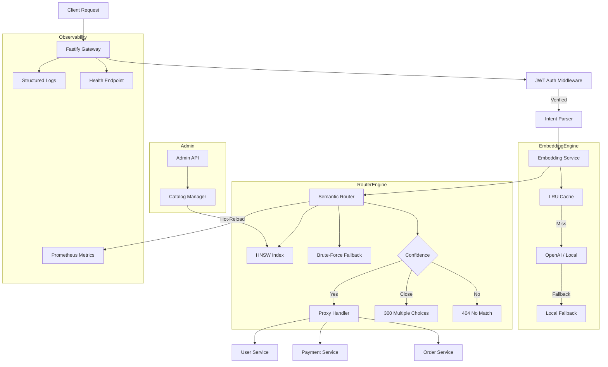
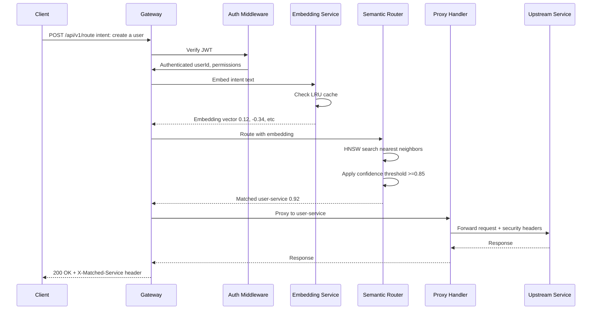
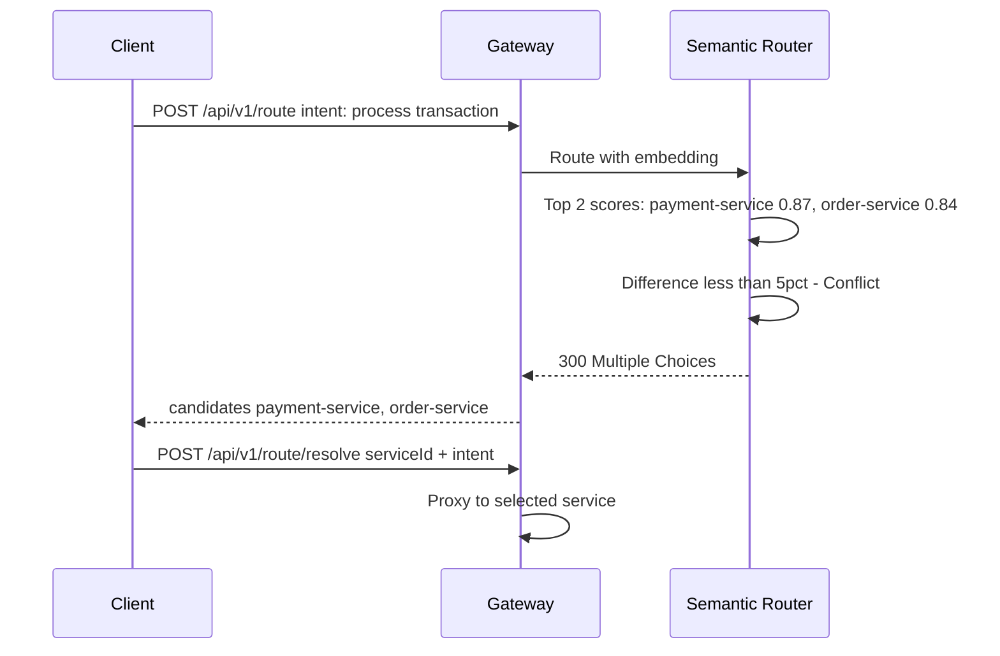

# Semantic API Gateway & Router

> Intent-based API routing via vector similarity — no static paths, pure semantic matching.

## Architecture Overview



## Request Flow



## Disambiguation Flow



## Components

| Component | File | Responsibility |
|-----------|------|---------------|
| Gateway Server | `src/server/gateway.ts` | Fastify server, routes, middleware |
| Auth Handler | `src/server/auth-handler.ts` | JWT verification, admin API key |
| Proxy Handler | `src/server/proxy-handler.ts` | Transparent upstream proxying |
| Semantic Router | `src/core/semantic-router.ts` | Intent matching, confidence, disambiguation |
| Embedding Service | `src/core/embedding-service.ts` | Embedding generation + cache + fallback |
| Catalog Manager | `src/registry/catalog-manager.ts` | Service registry + HNSW indexing |
| Types | `src/registry/types.ts` | All TypeScript interfaces and Zod schemas |
| Vector Math | `src/utils/vector-math.ts` | Cosine similarity, FNV hash |
| Logger | `src/monitoring/logger.ts` | Structured JSON logging with pino |
| Metrics | `src/monitoring/metrics.ts` | Prometheus counters and histograms |
| SDK | `src/sdk/auto-register.ts` | Self-registration SDK for microservices |

## API Endpoints

| Method | Path | Auth | Description |
|--------|------|------|-------------|
| `GET` | `/health` | None | Health check with dependency status |
| `GET` | `/metrics` | None | Prometheus metrics export |
| `POST` | `/api/v1/route` | JWT | Semantic routing — main entry point |
| `POST` | `/api/v1/route/resolve` | JWT | Resolve disambiguation choice |
| `POST` | `/api/v1/admin/register` | API Key | Register a new microservice |
| `DELETE` | `/api/v1/admin/services/:id` | API Key | Deregister a service |
| `PATCH` | `/api/v1/admin/services/:id` | API Key | Update a service |
| `GET` | `/api/v1/admin/services` | API Key | List all registered services |
| `POST` | `/api/v1/admin/reindex` | API Key | Re-index all service embeddings |

## Security Checklist

- [x] JWT verification on all semantic routes
- [x] Admin endpoints protected by API key (constant-time comparison)
- [x] Rate limiting (per-IP + per-user)
- [x] CORS restricted to explicit origins
- [x] Helmet security headers (CSP, HSTS, X-Frame-Options)
- [x] No PII in logs (authorization/cookie headers redacted)
- [x] Input validation with Zod schemas
- [x] Security context propagation (X-User-Id, X-User-Permissions headers)
- [x] 1MB body limit
- [x] Trust proxy enabled for X-Forwarded-For

## Quick Start

```bash
# 1. Install dependencies
npm install

# 2. Configure environment
cp .env.example .env
# Edit .env with your OpenAI API key and secrets

# 3. Development mode
npm run dev

# 4. Production build
npm run build && npm start
```

## SDK Usage — Auto-Registration

```typescript
import { registerWithGateway, deregisterFromGateway } from 'semantic-gateway-sdk';

// On service startup
const result = await registerWithGateway({
  gatewayUrl: process.env.GATEWAY_URL!,
  adminApiKey: process.env.ADMIN_API_KEY!,
  name: 'user-service',
  baseUrl: 'http://localhost:4001',
  version: '1.0.0',
  semanticDescription: 'Manages user accounts, profiles, authentication...',
  tags: ['users', 'auth'],
  securityTags: ['authenticated'],
});

// On shutdown
process.on('SIGTERM', () => {
  deregisterFromGateway(gatewayUrl, adminApiKey, result.id);
});
```

## Benchmarks

Run: `npm run benchmark`

```
╔══════════════════════════════════════════════════════════════════╗
║ Strategy                                   │ Avg (μs) │ QPS   ║
╠═════════════════════════════════════════════╪══════════╪═══════╣
║ Traditional Path Routing (Map.get)         │   ~0.05  │ ~20M  ║
║ Traditional Path Routing (Regex)           │   ~0.30  │ ~3M   ║
║ Semantic Routing (brute-force, 1536-dim)   │  ~50.00  │ ~20K  ║
║ Semantic Routing (HNSW approximate, 128)   │   ~5.00  │ ~200K ║
╚══════════════════════════════════════════════════════════════════╝
```

The semantic overhead is ~10-1000x vs path routing, but:
- Eliminates route configuration drift
- Supports natural language intents
- Auto-adapts when services change descriptions
- HNSW brings routing to sub-millisecond at scale

## License

MIT
