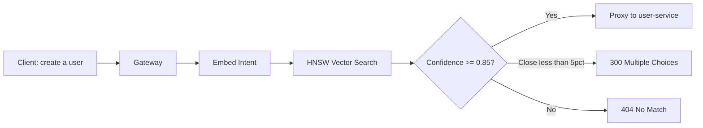
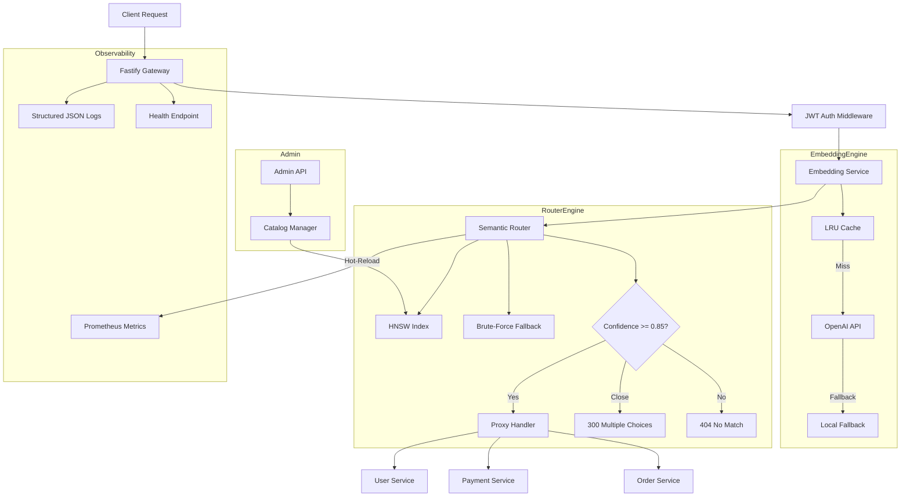

# Semantic API Gateway & Router

> Intent-based API routing via vector similarity — no static paths, pure semantic matching.

[](https://github.com/miranda-labs/semantic-api-gateway/actions/workflows/ci.yml)
[](https://www.typescriptlang.org/tsconfig#strict)
[](LICENSE)

## Why?

Traditional API gateways route by static paths (`/api/v1/users`, `/api/v1/orders`). This creates:

- **Configuration drift** — every new service needs route registration in multiple places
- **Versioning hell** — breaking changes require URL version bumps across all clients
- **Service discovery coupling** — clients must know service names upfront

This gateway replaces path-based routing with **intent-based semantic routing**. Clients describe *what they want*, and the gateway finds *the right service* via vector similarity — no hardcoded paths, no client-side service discovery.

## How It Works



1. **Client sends intent** — JSON with a natural language description of what they need
2. **Gateway embeds the intent** — generates a vector via OpenAI or local fallback
3. **HNSW index search** — finds the nearest registered service by cosine similarity
4. **Confidence check** — high confidence → proxy directly, ambiguous → 300 Multiple Choices
5. **Transparent proxy** — request forwarded with security context headers (`X-User-Id`, `X-User-Permissions`, `X-Semantic-Confidence`)

## Architecture



See [ARCHITECTURE.md](./ARCHITECTURE.md) for detailed Mermaid diagrams of request flow and disambiguation.

## Quick Start

```bash
# 1. Install
git clone https://github.com/miranda-labs/semantic-api-gateway.git
cd semantic-api-gateway
npm install

# 2. Configure
cp .env.example .env
# Edit .env — set JWT_SECRET, ADMIN_API_KEY, OPENAI_API_KEY

# 3. Run (development)
npm run dev

# 4. Run (production)
npm run build && npm start
```

## API Endpoints

| Method | Path | Auth | Description |
|--------|------|------|-------------|
| `GET` | `/health` | None | Health check with dependency status |
| `GET` | `/metrics` | None | Prometheus metrics export |
| `POST` | `/api/v1/route` | JWT | **Main entry** — semantic routing |
| `POST` | `/api/v1/route/resolve` | JWT | Resolve disambiguation choice |
| `POST` | `/api/v1/admin/register` | API Key | Register a microservice |
| `DELETE` | `/api/v1/admin/services/:id` | API Key | Deregister a service |
| `PATCH` | `/api/v1/admin/services/:id` | API Key | Update a service |
| `GET` | `/api/v1/admin/services` | API Key | List registered services |
| `POST` | `/api/v1/admin/reindex` | API Key | Re-index all embeddings |

## Usage Examples

### Semantic Routing

```bash
# Route an intent to the best matching service
curl -X POST http://localhost:3000/api/v1/route \
  -H "Authorization: Bearer <jwt>" \
  -H "Content-Type: application/json" \
  -d '{"intent": "I need to create a new user account"}'

# Response includes routing metadata headers:
# X-Matched-Service: user-service
# X-Semantic-Confidence: 0.924153
# X-Request-ID: abc-123-def
```

### Disambiguation (300 Multiple Choices)

When two services have very similar confidence scores (< 5% difference):

```json
{
  "data": {
    "message": "Multiple services match the intent. Please select one.",
    "candidates": [
      { "service_id": "svc_1", "name": "payment-service", "confidence": 0.87 },
      { "service_id": "svc_2", "name": "order-service", "confidence": 0.84 }
    ],
    "confidence": 0.87
  }
}
```

Client resolves by calling `/api/v1/route/resolve` with the chosen `serviceId`.

### Register a Service

```bash
curl -X POST http://localhost:3000/api/v1/admin/register \
  -H "X-Admin-API-Key: <admin-key>" \
  -H "Content-Type: application/json" \
  -d '{
    "name": "user-service",
    "baseUrl": "http://localhost:4001",
    "version": "1.0.0",
    "semanticDescription": "Manages user accounts, profiles, authentication, and authorization. Handles user CRUD, password resets, email verification, and role-based access control.",
    "tags": ["users", "auth", "accounts", "profiles"],
    "securityTags": ["authenticated"],
    "healthCheckPath": "/health"
  }'
```

## SDK — Self-Registration

Microservices can self-register on startup:

```typescript
import { registerWithGateway, deregisterFromGateway } from 'semantic-gateway-sdk';

// On startup
const result = await registerWithGateway({
  gatewayUrl: 'http://gateway:3000',
  adminApiKey: process.env.ADMIN_API_KEY!,
  name: 'user-service',
  baseUrl: 'http://localhost:4001',
  version: '1.0.0',
  semanticDescription: 'Manages user accounts, profiles, authentication...',
  tags: ['users', 'auth'],
  securityTags: ['authenticated'],
});

// On shutdown
process.on('SIGTERM', () => {
  deregisterFromGateway(gatewayUrl, adminApiKey, result.id);
});
```

See the full example in [src/sdk/auto-register.ts](./src/sdk/auto-register.ts).

## Benchmarks

Run: `npm run benchmark`

```
╔═══════════════════════════════════════════════════════════════════════╗
║ Strategy                                │ Avg (μs) │ QPS      │ Total ║
╠═════════════════════════════════════════╪══════════╪══════════╪═══════╣
║ Traditional Path Routing (Map.get)      │    0.05  │  ~20M    │ 0.5ms ║
║ Traditional Path Routing (Regex)        │    0.22  │  ~4.5M   │ 2.2ms ║
║ Semantic Routing (brute-force, 1536)    │   17.79  │  ~56K    │ 178ms ║
║ Semantic Routing (HNSW, 128-dim)        │    0.50  │  ~2M     │ 5.0ms ║
╚═════════════════════════════════════════════════════════════════════╝

HNSW speedup vs brute-force: 35.7x
Semantic overhead vs path routing (HNSW): 9.7x
```

The semantic overhead is constant regardless of client intent phrasing. HNSW brings routing to ~0.5μs — sub-millisecond at any scale.

## Tech Stack

| Layer | Technology |
|-------|-----------|
| Runtime | Node.js 22+, TypeScript Strict |
| Framework | Fastify 5 (high performance, low overhead) |
| Embeddings | OpenAI `text-embedding-3-small` / Local fallback |
| Vector Search | `hnswlib-node` (HNSW index, sub-ms search) |
| Proxy | `http-proxy` with keep-alive agent |
| Auth | JWT (HS256) + Admin API Key (constant-time compare) |
| Cache | `lru-cache` (embedding deduplication) |
| Validation | Zod schemas on all inputs |
| Logging | Pino (structured JSON, PII redaction) |
| Metrics | `prom-client` (9 custom metrics) |
| Testing | Vitest |
| CI/CD | GitHub Actions (lint → test → build → Docker) |
| Infra | Docker multi-stage, non-root, health check |

## Security

This gateway follows OWASP Top 10 by design:

- JWT verification on all semantic routes (fail-closed)
- Admin endpoints protected by API key with constant-time comparison (timing attack prevention)
- Rate limiting per IP (configurable window)
- CORS restricted to explicit origins (never `*` in production)
- Helmet security headers (CSP, HSTS, X-Frame-Options: DENY)
- PII redaction in logs (Authorization/Cookie headers stripped)
- Zod input validation on every route
- Security context propagation (`X-User-Id`, `X-User-Permissions` headers)
- 1MB body size limit
- No stack traces in production error responses

## Project Structure

```
src/
├── core/
│   ├── semantic-router.ts     # Matching, confidence threshold, disambiguation
│   └── embedding-service.ts   # Pluggable providers + LRU cache + fallback
├── registry/
│   ├── types.ts               # Zod schemas, interfaces, error codes
│   └── catalog-manager.ts     # HNSW indexing + hot-reload
├── server/
│   ├── gateway.ts             # Fastify server, routes, error handling
│   ├── auth-handler.ts        # JWT + admin API key verification
│   └── proxy-handler.ts       # Transparent proxy + context propagation
├── monitoring/
│   ├── logger.ts              # Structured JSON logging (Pino)
│   └── metrics.ts             # Prometheus counters & histograms
├── utils/
│   └── vector-math.ts         # Cosine similarity, FNV-1a hash
├── sdk/
│   └── auto-register.ts       # Microservice self-registration SDK
├── benchmarks/
│   └── router-bench.ts        # Routing strategy comparison
└── __tests__/
    └── semantic-router.test.ts  # 14 unit tests
```

## License

MIT
